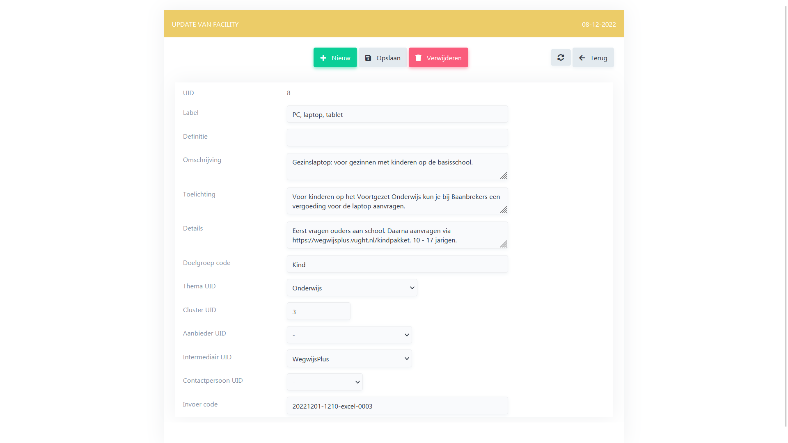
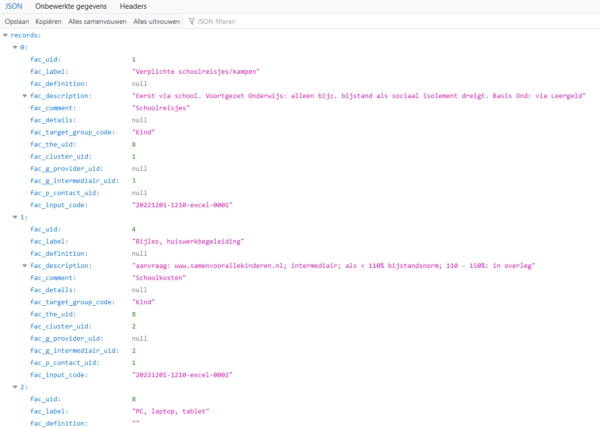
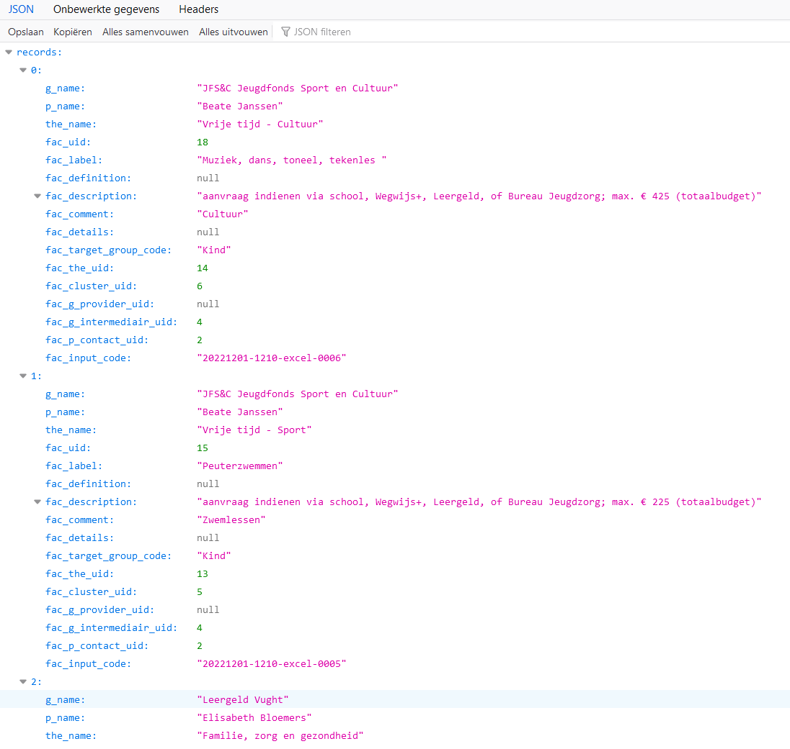
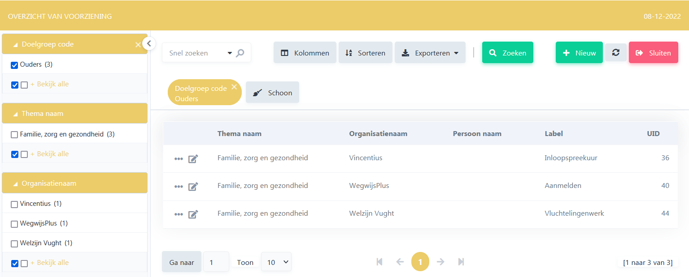

# PoC Voorzieningen met Harmonisator

## Opdracht en doel 

De opdracht is geformuleerd in het [werkpakket Voorzieningen registratie](https://github.com/MinBZK/regels.overheid.nl/issues/51). De Proof of Concept (PoC) heeft tot doel om een basisversie van een Voorzieningen applicatie te ontwikkelen, die kan doorgroeien tot een generiek inzetbare toepassing voor alle gemeenten. Daarbij wordt de meerwaarde van de Harmonisator-aanpak zichtbaar.

We maakten een kleine Voorzieningen-applicatie en API, op grond van de spreadsheetvoorbeelden van de gemeente Vught. Zo wordt de samenhang zichtbaar tussen de aanpak van de "Harmonisator" en de ontwikkeling van een generiek bruikbare en duurzame Voorzieningen-applicatie, die aansluit op de principes en het gedachtegoed van regels.overheid.nl. De kern hiervan is dat eerst de begrippen, relaties en definities helder zijn vastgelegd, als stevig fundament voor tal van toepassingen van gegevens- en informatiegebruik.

### Voorzieningen Vught in spreadsheet

Er zijn twee voorbeelden van spreadsheets met overzicht op de voorzieningen. Deze zijn vanuit gebruikersoptiek handzaam, compact en makkelijk aan te passen (het is structuur, opmaak én data in één). Daarmee is het voor de gemeente waarschijnlijk voldoende informatief voor gebruik in kleine kring van ambtelijke gebruikers, maar niet voor gebruik door inwoners. De spreadsheets gebruiken we voor analyse van de gegevensstructuur en om voorbeelddata in te voeren. 

### Globale aanpak

- Analyse van informatiebehoefte en gebruik
- Begrippen vastleggen in een schema met de Harmonisator (term + definitie)
- De bedrijfsobjecten benoemen en attributen toevoegen als relaties naar termen 
- Een gegevensmodel genereren uit Harmonisator-model
- Een API genereren uit Harmonisator-model
- Een proefdatabase opzetten en vullen
- Een zoekfunctie bieden die de API gebruikt

## Resultaten

### Startpunt: proefgegevens uit spreadsheets Vught

Een praktijkvoorbeeld van de informatiebehoefte en gebruik van de gemeente Vught over lokale voorzieningen. De spreadsheet is geanalyseerd en een eerste vorm van de gegevensstructuur wordt zichtbaar. We hebben termen toegevoegd (b.v. fac_label) die later in de Harmonisator een kenmerk zijn. Dat zijn meestal de spreadsheet-kopjes.

Een spreadsheet laat eenvoudig een-op-veel relaties toe. Zie b.v. doelgroep, thema of organisatie. Deze worden allemaal 'termen' in de Harmonisator, zijn van het type 'entiteit' en kennen eigen attributen (b.v. telefoon bij persoon).

### Schema "Voorzieningen" 

In de Harmonisator is een schema toegevoegd en opgebouwd met de naam 'Openbare Voorzieningen Registratie'. In de PoC gevuld met 43 termen die eerder zijn gevonden in de spreadsheet . Een deel heeft een definitie heeft gekregen. 

*Voorbeeld schermafdruk met het schema en termen binnen de context van voorzieningen*

### Definitielijst als begrippenkader Voorzieningen

#### Definitie Voorziening

Uit het schema zijn nu losse definities op te halen. Bijvoorbeeld:

_Alle vormen van ondersteuning die geboden worden door nationale of gemeentelijke overheden, maatschappelijke en charitatieve instellingen._

#### Lijst van definities binnen het schema

*Voorbeeld schermafdruk van termen en hun definitie* 

### 'Voorziening' als begrip

*Voorbeeld schermafdruk van de term 'voorziening' en alle relaties.*

## Conceptueel gegevensmodel Voorzieningen

De objecttypen en hun samenhang bij Voorzieningen. Een voorziening doorloopt een levenscyclus langs de weg: behoefte, ontwikkeling, aanbieding/promotie, aanvraag, gebruik, bijstelling en afbouw.

- Gegevens van organisaties en personen (actoren) kunnen uit het generieke gegevensmodel 'Samenwerken' (coöperatie, afkorting 'co') worden gehaald.
- De categorisering en clustering van voorzieningen kan volgens standaard thema-indelingen, b.v. van data.overheid.nl worden toegepast.

Het model is voorbereid op het toepassen van regels op de beschikbaarheid van een voorziening (regels.overheid.nl).

- De gegevens over de rechten op een voorziening worden in de entiteit 'Voorziening_Regelset' opgenomen.
- De entiteit 'Ingezetene' fungeert als (toekomstige) datakluis, mogelijk volgens principes van IRMA. 

*Conceptueel gegevensmodel Voorzieningen, gemaakt met Sparx EA.*

## Logisch gegevensmodel Voorzieningen

### Entiteiten uit het schema 'Samenwerken' 

Het schema 'samenwerken' is een voorbereiding op een generiek deelsysteem met veel gebruikte entiteiten, zoals organisatie, persoon en thema. Een soort 'basisregistratie', dat als een deelsysteem door andere toepassingen kan worden hergebruikt. In het schema getekend met een kader.

*Voorbeeld schermafdruk van een deel van de entiteiten van 'samenwerken'.*

### Entiteiten en attributen met datatypen

De term/entiteit 'voorziening' heeft attributen die met de relatie 'kenmerk' zijn opgenomen. In de PoC zijn deze voorzien van een eenvoudig datatype en lengte.

*Voorbeeld schermafdruk attributen van voorziening*

## Technisch gegevensmodel Voorzieningen 

Voorbeeld van een uit de Harmonisator gegenereerd script om een tabel te maken voor gebruik in de relationele database MySQL.  
Naamgevingconventies: Engelstalig, snake_case, entiteit prefix in attribuutnaam.

<pre>
--
-- Tabel Voorzieningen: `facility`
--
DROP TABLE IF EXISTS facility; 
CREATE TABLE facility  ( 
	fac_uid int(11) NOT NULL AUTO_INCREMENT PRIMARY KEY COMMENT 'versie 0.1.15',
	fac_lang_code varchar(5),
	fac_name varchar(255),
	fac_label varchar(255),
	fac_definition varchar(255),
	fac_description varchar(500),
	fac_comment text,
	fac_details text,
	fac_target_group_code varchar(255),
	fac_the_uid int(11),
	fac_cluster_uid int(11),
	fac_g_provider_uid int(11),
	fac_g_intermediair_uid int(11),
	fac_p_contact_uid int(11),
	fac_facr_uid int(11),
	fac_110 char(1),
	fac_120 char(1),
	fac_150 char(1),	
	fac_input_code varchar(100) 
	
) ENGINE=InnoDB DEFAULT CHARSET=utf8; 
</pre>

## CRUD-onderhoudsfuncties in PHP

Lijstfunctie en onderhoudsscherm voor Voorziening (facility) met Scriptcase voor invoer proefgegevens. Scriptcase is een PHP=codegenerator, een low-code ontwikkeltool, voor kleinschalig gebruik. Handig voor niet-programmeurs om snel CRUD-functies te maken om te prototypen en om gegevensbehoefte en specificaties te verkennen.  

*Voorbeeld schermafdruk overzicht voorziening met zoek- en groepeerfunctie*

*Voorbeeld schermafdruk enkel record voorziening*

## JSON schema van voorzieningen

## API van voorzieningen

Vanuit de MySQL database kunnen met de API.php ([Github - Maurits van der Schee](https://github.com/mevdschee/php-crud-api)) diverse JSON-files worden opgehaald.

### Voorbeeld1

http://localhost/harmonisator/api.php/records/facility

*Voorbeeld schermafdruk deel van resultaat.*

#### Voorbeeld2

http://localhost/harmonisator/api.php/records/facility_view

*Voorbeeld schermafdruk deel van resultaat op view.*

## Zoek app als demo

Vanuit de API zijn diverse toepassingen te maken. Bijvoorbeeld een zoekfunctie voor ouders.

